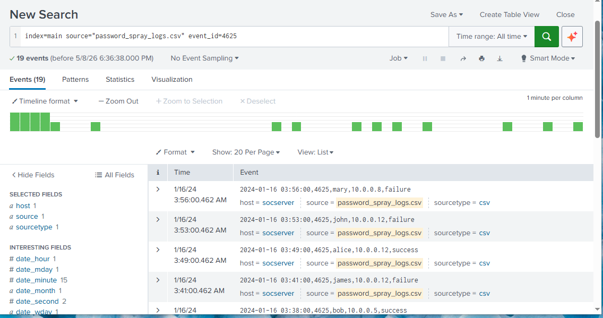
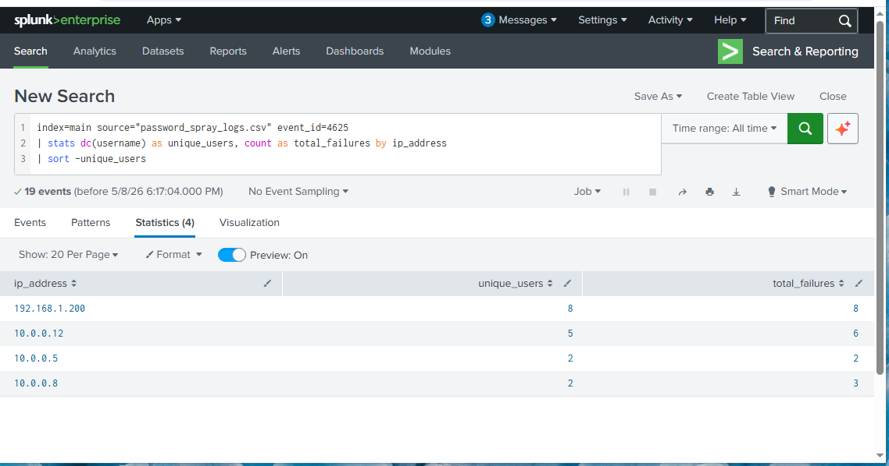
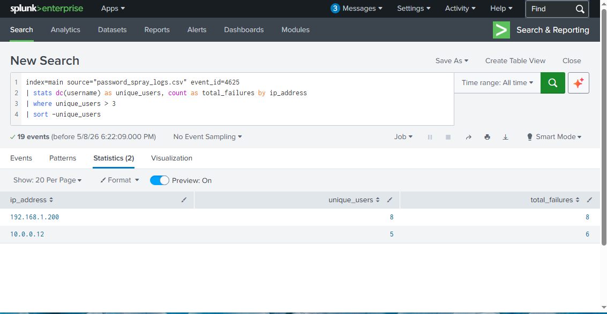
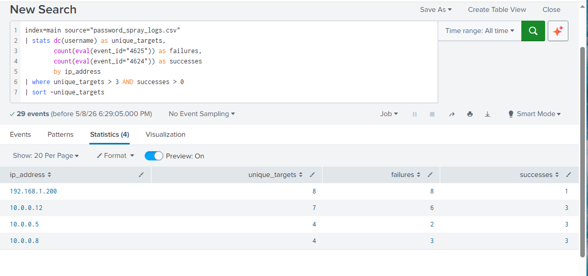
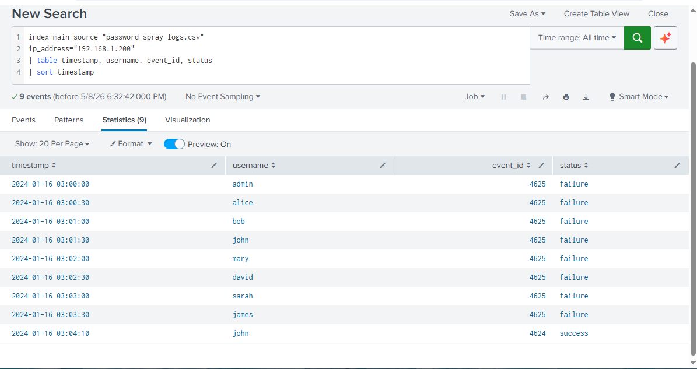

# 🔍 Password Spray Detection Using Splunk
## SIEM-Based Detection of Password Spray Attacks

---

## 📌 Problem
Unlike brute force attacks that target one account 
with many passwords, password spray attacks try one 
password against many accounts — deliberately staying 
below lockout thresholds to avoid detection.

This project builds detection logic to identify 
password spray attacks using Splunk SIEM and 
Windows authentication logs.

---

## ⚔️ Brute Force vs Password Spray

| Attack Type | Method | Detection Challenge |
|---|---|---|
| **Brute Force** | Many passwords → one account | Triggers lockout threshold |
| **Password Spray** | One password → many accounts | Stays below lockout threshold |

---

## 🎯 Objectives
- Simulate a realistic password spray attack in Python
- Ingest logs into Splunk SIEM for analysis
- Write SPL queries to detect the spray pattern
- Reconstruct the full attack timeline from logs

---

## 🛠️ Tools Used
| Tool | Purpose |
|---|---|
| **Splunk** | SIEM platform for log analysis |
| **Python** | Attack simulation and log generation |
| **SPL** | Splunk search language for detection queries |
| **Windows Event IDs** | Authentication log standards |

---

## 🗃️ Logs Used
Simulated Windows Authentication Logs (CSV format)

| Event ID | Meaning |
|---|---|
| 4625 | Failed Login Attempt |
| 4624 | Successful Login |

**Attack Pattern:**
- Same IP address
- Different usernames each attempt
- One password tried per account
- Eventual successful login

---

## 🔎 Detection Queries (SPL)

### Query 1 — Find All Failed Logins
index=main source="password_spray_logs.csv"
event_id=4625
Retrieves all failed login attempts from the dataset.

### Query 2 — Count Distinct Users Per IP
index=main source="password_spray_logs.csv"
event_id=4625
| stats dc(username) as unique_users,
count as total_failures
by ip_address
| sort -unique_users
Count how many different usernames each IP targeted.
This is the key difference from brute force detection —
we look for unique accounts, not just total failures.

### Query 3 — Flag IPs Targeting Multiple Accounts
index=main source="password_spray_logs.csv"
event_id=4625
| stats dc(username) as unique_users,
count as total_failures
by ip_address
| where unique_users > 3
| sort -unique_users
Flags any IP targeting more than 3 different accounts
as suspicious — the password spray threshold.

### Query 4 — Smoking Gun: Spray + Successful Login
index=main source="password_spray_logs.csv"
| stats dc(username) as unique_targets,
count(eval(event_id="4625")) as failures,
count(eval(event_id="4624")) as successes
by ip_address
| where unique_targets > 3 AND successes > 0
| sort -unique_targets
Identifies IPs that targeted many accounts AND 
eventually succeeded — confirming a password spray 
attack.

### Query 5 — Full Attack Timeline
index=main source="password_spray_logs.csv"
ip_address="192.168.1.200"
| table timestamp, username, event_id, status
| sort timestamp
Reconstructs the complete attack timeline showing 
exactly which accounts were targeted and when.

---

## 📸 Results

### Query 1 — All Failed Logins

### Query 2 — Distinct Users Per IP

### Query 3 — Threshold Detection

### Query 4 — Smoking Gun

### Query 5 — Attack Timeline

---

## 🧠 Analysis

### Attack Reconstruction
03:00:00 - admin  - 4625 - failure ❌
03:00:30 - alice  - 4625 - failure ❌
03:01:00 - bob    - 4625 - failure ❌
03:01:30 - john   - 4625 - failure ❌
03:02:00 - mary   - 4625 - failure ❌
03:02:30 - david  - 4625 - failure ❌
03:03:00 - sarah  - 4625 - failure ❌
03:03:30 - james  - 4625 - failure ❌
03:04:10 - john   - 4624 - success ✅
### Key Findings

**Finding 1 — Systematic Account Targeting**
IP 192.168.1.200 attempted exactly one login per 
account across 8 different usernames in under 5 
minutes. This systematic pattern is consistent 
with automated password spray software.

**Finding 2 — Lockout Evasion**
Each account received only one failed attempt —
deliberately staying below the typical 5 attempt
lockout threshold. This confirms the attack was
designed to evade standard security controls.

**Finding 3 — Off-Hours Activity**
The attack occurred at 03:00AM — outside normal 
business hours to avoid detection by security teams.

**Finding 4 — Successful Compromise**
The attacker successfully authenticated as "john" 
at 03:04:10AM after targeting 8 accounts. The john 
account must be treated as fully compromised.

---

## ⚔️ Why This Is Harder to Detect Than Brute Force

| Detection Method | Brute Force | Password Spray |
|---|---|---|
| Account lockout | ✅ Triggers lockout | ❌ Avoids lockout |
| Failure threshold per account | ✅ Easy to detect | ❌ Only 1 failure per account |
| Distinct user analysis | ➖ Not needed | ✅ Required for detection |
| Timeline reconstruction | ➖ Optional | ✅ Essential |

---

## ✅ Conclusion & Recommendations

### Immediate Actions
| Priority | Action |
|---|---|
| 1 | 🚫 Block 192.168.1.200 at the firewall |
| 2 | 🔒 Lock and reset john's compromised account |
| 3 | 🔍 Investigate all actions taken after 03:04AM |
| 4 | 📢 Escalate to Tier 2 for forensic investigation |
| 5 | 🔎 Check all 8 targeted accounts for compromise |

### Preventive Recommendations
| Recommendation | Purpose |
|---|---|
| Enable MFA | Renders password spray useless even if password is correct |
| Monitor distinct user failures per IP | Detects spray pattern early |
| Real-time Splunk alerts | Immediate notification of spray attempts |
| Strong password policy | Reduces chance of spray success |

---

## 🔗 Related Projects
- [Brute Force Detection](https://github.com/Phredreeq/brute-force-detection)
- [Incident Investigation Report](https://github.com/Phredreeq/incident-investigation-report)
- [ML Anomaly Detection](https://github.com/Phredreeq/anomaly-detection-login-behaviour)

---

## 👤 Author
Fredrick Agufenwa

Cybersecurity Student | SOC & Threat Detection
